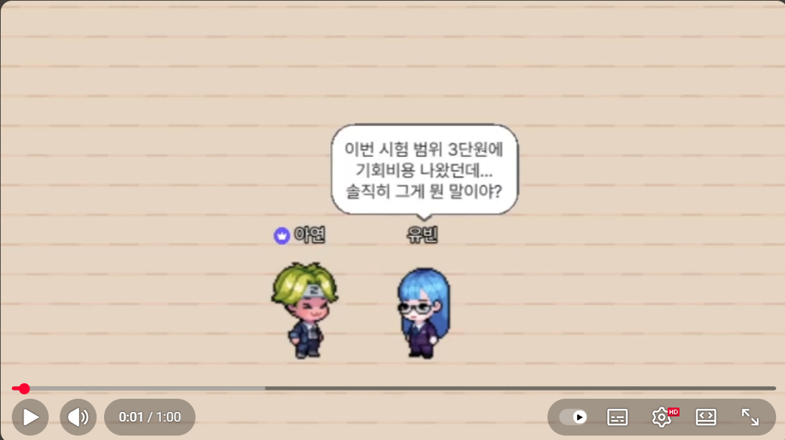
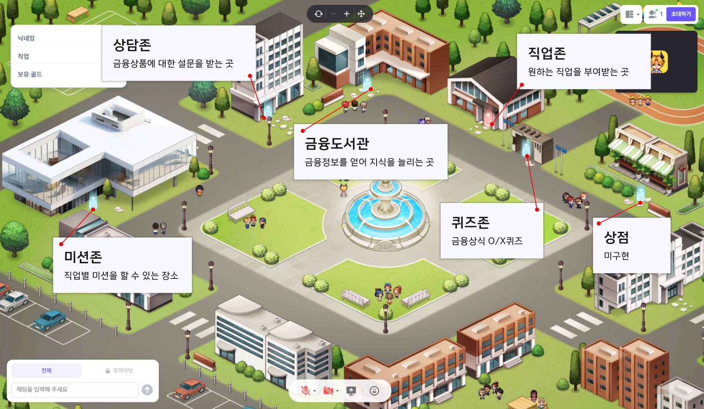
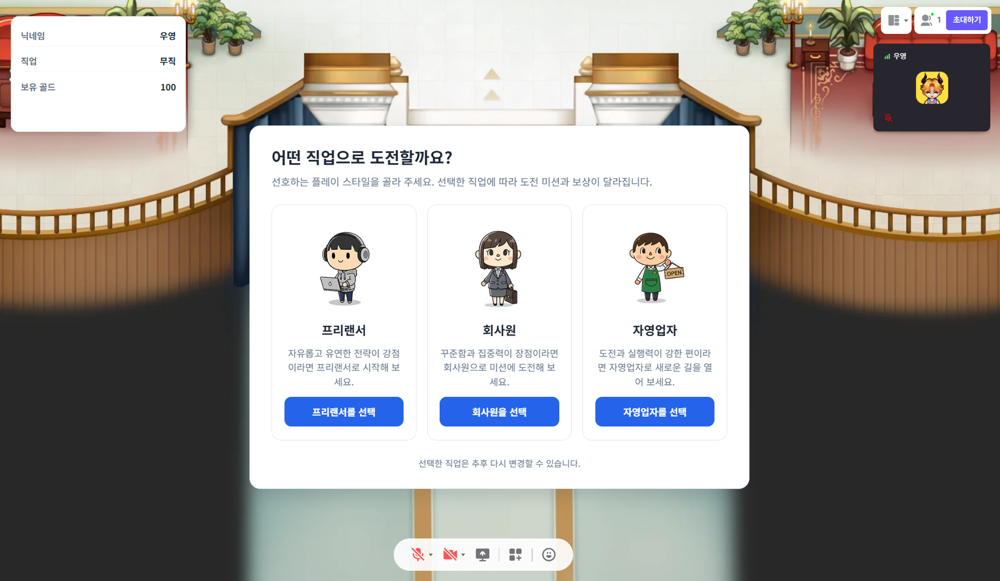
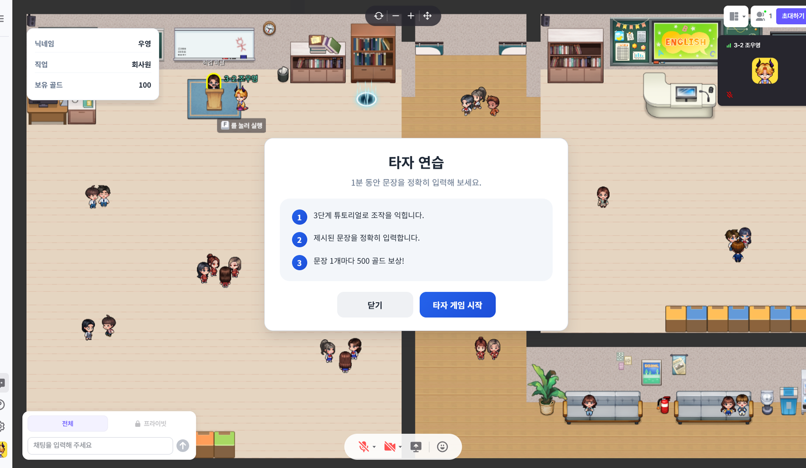
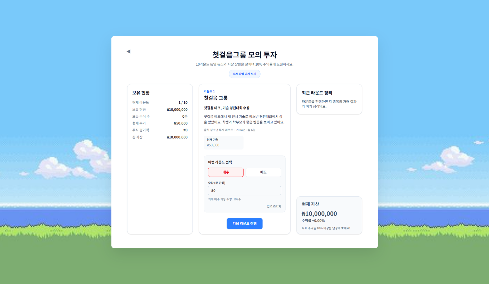

  

    

      

      <h1 align="center">첫걸음 타운</h1>
      <h4 align="center">메타버스 환경의 청소년 금융지식 향상 플랫폼</h4> 
      
        
      

        

          <strong>청소년 금융지식을 향상</strong>을 목적으로 메타버스 환경에서 게임형식으로  금융활동을 체험하며 리스크 없이 <strong>실패를 하며 배우는 금융교육</strong> 플랫폼. 소비 성향에 맞는 직업을 선택해 그에 맞는 금융활동을 하며 재화를 벌고 쓰며,  플랫폼 내 금융도서관을 통한 금융지식도 향상시키는 금융 교육 플랫폼
        

      

       
      

        

          <ul style="text-align: left; display: inline-block;">
            <li><strong>📅 개발 기간</strong> : 2025.10.14 ~ 2025.11.23 (6주)</li>
            <li><strong>💻 플랫폼</strong> : Web / Mobile / ZEP</li>
            <li><strong>👨‍👩‍👦‍👦 개발 인원</strong> : 4명</li>
            <li><strong>🏢 주관</strong> : K-해커톤13 (교육과학기술부 주관)</li>
          </ul>
        

      

      

      <h3>영상 포트폴리오 🔗</h3>
      
    

       

    <h2 align="left">🔎 목차</h2>
    

      <h4><a href="#developers">✨ 팀 구성</a></h4>
      <h4><a href="#keyFeatures">🌠 주요 기능</a></h4>
    

      

    <h2 align="left"><a name="developers">✨ 팀 구성</a></h2>
    

      <table>
        <tr>
          <td width="20%" align="center">
            <a href="https://github.com/Jodndud" target="_blank">
                
              

                <strong>조우영(팀장)</strong> 
                《기획, ZEP Script 개발》
            </a>

          </td>
          <td width="20%" align="center">
            <a href="https://github.com/dahyunsouth" target="_blank">
                
              

                <strong>이상욱</strong> 
                《ZEP Script 개발, FE, 배포》
            </a>

          </td>
        </tr>
        <tr>
          <td width="168px" valign="top">
            
              - 기획 
              - ZEP UI 디자인 
              - ZEP Script 개발(외부 API 연동)
            
          </td>
          <td width="168px" valign="top">
            
              - 직업별 게임 FE개발 
              - ZEP Script 개발(ZEP내부 UI구현) 
              - AI기반 설문조사 기능 구현 
              - 서비스 내 기능 배포
            
          </td>
        </tr>
      </table>
      <table>
        <tr>
          <td width="20%" align="center">
            <a href="https://github.com/0w0n2" target="_blank">
                
              

                <strong>신유빈</strong> 
                《기획, 발표》
            </a>

          </td>
          <td width="20%" align="center">
            <a href="https://github.com/Me-in-U" target="_blank">
                
              

                <strong>염아연</strong> 
                《BE, FE》
            </a>

          </td>
        </tr>
        <tr>
          <td width="168px" valign="top">
            
              - 중간발표 및 최종발표 
              - 기획 배경 및 자료수집
            
          </td>
          <td width="168px" valign="top">
            
              - 메타버스 환경 맵 구조 기획 
              - 사용자 저장 데이터베이스 구축
            
          </td>
        </tr>
      </table>
    

      

    

  <h2 align="left"><a name="keyFeatures">🌠 주요 기능</a></h2>
  

    <table>
      <tbody align="center">
        <tr>
          <th style="text-align: center"> 메타버스 맵 </th>
          <th style="text-align: center"> 직업선택 </th>
        </tr>
        <tr>
          <td width="50%"></td>
          <td width="50%"></td>
        </tr>
      </tbody>
      <tbody align="center">
        <tr>
          <th style="text-align: center"> 게임 모달 </th>
          <th style="text-align: center"> 게임화면 </th>
        </tr>
        <tr>
          <td width="50%"></td>
          <td width="50%"></td>
        </tr>
      </tbody>
    </table>
  

    

